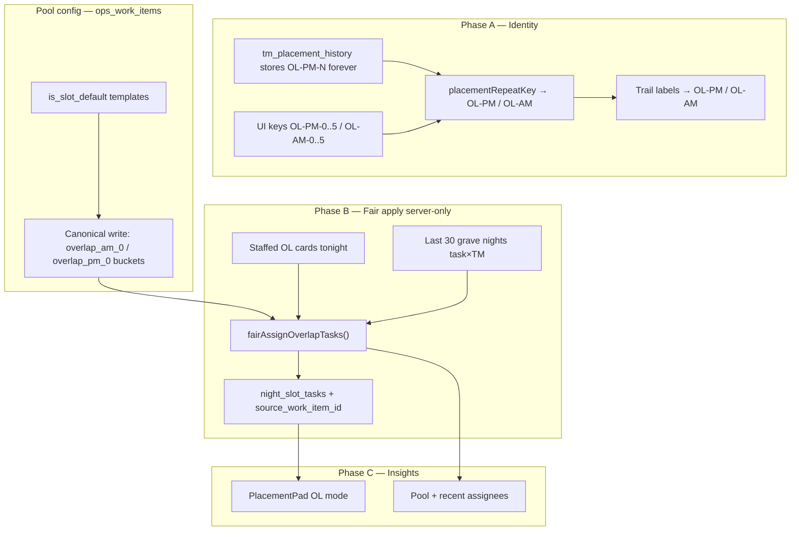

# Overlap Fungible Seats + Task-Based Rotation

| Field | Value |
| --- | --- |
| **Title** | Overlap Fungible Seats + Task-Based Rotation (ShiftBuilder) |
| **Author** | _(design — Grok Build)_ |
| **Date** | 2026-07-12 |
| **Status** | **Implemented** (2026-07-12) — PR1–PR7 + Phase D.1 (day + priority cut); prod fair flag still operator-owned |
| **Repo** | `/Users/briankillian/oms_root` (gunlakecasino/shiftplanner) |
| **Related** | `docs/TASKS_SYSTEM_PLAN.md` (partially **superseded for OL apply** — see K13), `src/lib/shiftbuilder/rotation/placementPadHelpers.ts`, `src/lib/shiftbuilder/data.ts`, `src/app/shiftbuilder/components/FloatingNav.tsx` |

**Implementation notes (shipped in tree):** dual-format OL history (store `OL-PM-N` / `OL-AM-N`, match band `OL-PM` / `OL-AM`); Apply Overlap via `applyOverlapTasksToNight` + server env **`OVERLAP_FAIR_APPLY`** (`1` = fair, `0`/unset = seeded random); dead `pushTaskDefaults*` / `getSlotDefaultTasks` removed (PR7).

**Phase D.1 (shipped):** day-of-week filter (`recurrence_days`) + priority/pool_sort cut (`n = staffed seats`) before fair/random assign; Defaults UI day chips + priority cycle + reorder; Apply confirm shows tonight’s plan (selected / skip staffing / not today); pad insights list tonight-eligible pool. Pure module: `rotation/overlapPoolSelect.ts`.

---

## Overview

Operators report that insights, rotations, placements, and related systems treat **overlap (OL) seats like zone/RR stations**. That model is wrong for graves ops:

- **Seats in a band are fungible.** Within PM or AM, card index (`OL-PM-0`…`5` / `OL-AM-0`…`5`) does not carry operational identity. Filling N staffed seats matters; order among indices does not.
- **Work is task-based.** Overlap nights are driven by a **pool of tasks** that varies by day of week, staffing count, and AM vs PM band — not by walking a fixed station trail or fit-chip matrix.

This design formalizes that model in four shippable phases:

1. **Phase A — Placement identity:** collapse OL indices into band-level keys for trails/history **matching** (historical rows stay indexed forever; no zone-style fit chips).
2. **Phase B — Task-fair apply:** **deliberately reintroduce** operator-triggered Apply Overlap as staffed-pool apply on `ops_work_items` (policy override of Tasks cutover for OL only), then upgrade pure random to history-aware fair rotation with template-id write-through.
3. **Phase C — Overlap insights pad:** task-rotation view when an OL card is open.
4. **Phase D — Optional later:** staffing-tier pools, auto-seat assign, task-swap between OL TMs.

---

## Background & Motivation

### Ops reality (product)

| Concern | Overlaps | Zones / RR (contrast) |
| --- | --- | --- |
| Seat identity | Fungible within AM or PM band | Slot identity matters (`Z4 ≠ Z7`, `MRR8 ≠ WRR8`) |
| Rotation unit | **Tasks** across staffed people | **Places** over weeks |
| Engine walk | Outside core fill order | Core walk + coverage tiers |
| Fit chips / swap lanes | Not meaningful | Primary operator surface |
| History language | Band (`OL-PM` / `OL-AM`), not card index | Zone codes / RR side trails |

AM overlaps are next-calendar-morning relative to the grave sheet night; PM is the late-evening band. Bands stay separate for eligibility and task pools.

### Current codebase (verified)

#### Placement / rotation already treats OL as non-deployment

| Mechanism | Behavior | Location |
| --- | --- | --- |
| Fit chips | Disabled for `OL-*`, `overlap_am/pm` | `shouldShowPlacementFitChip` in `src/lib/shiftbuilder/rotation/placementPadHelpers.ts` |
| Swap lanes | OL excluded | `isSwapEligibleSlotKey` (same file) |
| Deployment fit map keys | OL **not** included | `collectDeploymentSlotKeys` — zones + RR + aux only |
| Engine walk order | OL outside core walk | `xaiFillOrderContract.ts` (hard rule 4) |
| `prior_placement_repeat` | Admin/overlap exempt via fit-chip gate (`isRotationTracked`) | `scoring.ts`, `engine/context.ts`, `engineRules.ts` |
| Engine insight | Hard ban on suggesting Admin/OL swaps | `engineInsightForPlacement.ts` |

These exclusions are **correct** for zone-style rotation. They must **stay**. Phase A does not invent fit chips on OL. Collapse of OL indices in `placementRepeatKey` must **not** enable rotation hard gates: any path that scores “same area repeat” must continue to gate on `shouldShowPlacementFitChip` / `isRotationTracked === false` for OL.

#### Placement identity still indexes OL seats

```ts
// placementPadHelpers.ts — current (RR only)
export function placementRepeatKey(ui: string): string {
  if (!ui) return ui;
  const rr = ui.match(/^(?:M|W)?RR(\d+)$/i);
  if (rr) return `RR${rr[1]}`;
  return ui;
}
```

- RR is area-merged (`MRR8` / `WRR8` → `RR8`).
- **OL is not:** `OL-PM-0` and `OL-PM-3` remain distinct keys.
- `formatCardPlacementTrailLabel` has no OL branch; OL UI keys fall through to the raw string (e.g. `OL-PM-0`).
- Preference matching already supports category targets like `OL-AM` via prefix match without trailing digit (`preferenceTargetMatches` in `scoring.ts`) — useful precedent for band-level identity.
- **History storage:** `tm_placement_history.slot_key` is written as **UI keys** via `resolveHistoryUiSlotKey` → `dbToUi` → `normalizeHistoryUiKey` (`opsMutations.server.ts`). Neither `normalizeHistoryUiKey` nor `normalizePlacementIdentity` collapses OL bands today. Rows already in DB are and will remain `OL-PM-N` / `OL-AM-N`.

#### Slot keys (UI ↔ DB)

| UI | DB | Display (`slotKeyToLabel`) |
| --- | --- | --- |
| `OL-PM-0`…`5` | `overlap_pm_0`…`5` | `PM Overlap 1`…`6` (1-indexed) |
| `OL-AM-0`…`5` | `overlap_am_0`…`5` | `AM Overlap 1`…`6` |

Canonical mapping: `src/lib/shiftbuilder/slot-keys.ts`. Storage remains per physical card in `zone_assignments` with `slot_type='overlap'` — fungibility is a **semantic/identity** layer, not a schema collapse of six seats into one.

#### Eligibility

- `OL-AM*` → grave + AM signal (`gravePool === "AM"` or AM schedule flag).
- `OL-PM*` → grave + PM signal.
- Full zones/RR reject pure overlap-pool TMs.

Source: `eligibilityCore.ts`, `placement.ts`, engine `eligibility.ts`.

#### Task defaults cutover — intentional retirement, residual dead code, product reintroduction

The Tasks cutover (`docs/TASKS_SYSTEM_PLAN.md` v2.1, T2 / §4.12) **intentionally retired** Apply Default Tasks / Apply Overlap Tasks and replaced `slot_default_tasks` with **`ops_work_items` where `is_slot_default=true`**, materializing chips primarily on **night create** via `applySlotDefaultsToNight`.

| Path | Status (post-PR7) | Behavior |
| --- | --- | --- |
| `getSlotDefaultTasks()` / `pushTaskDefaultsToNight` / `pushTaskDefaultsToWeek` | **Removed (PR7)** | Legacy `slot_default_tasks` path deleted; no callers |
| Apply Default Tasks (zones/RR) | **Retired (K15)** | Night create only via `applySlotDefaultsToNight` (excludes `overlap_*`) |
| **Apply Overlap Tasks** | **Live (K13)** | FloatingNav + `applyOverlapTasksToNight` → server fair/random under `OVERLAP_FAIR_APPLY` |
| `applySlotDefaultsToNight` | **Live successor** | Reads `ops_work_items`; **skips all `overlap_*`** (K11) |
| Night create | Seeds non-OL only | OL standing work applied after seating |
| Projects → Defaults | Band pools | AM/PM write `overlap_*_0`; distributed on Apply Overlap |

**This is not “finish a broken cutover.”** It is three separate facts:

1. **Intentional product retirement** of operator Apply UX per Tasks plan T2/§4.12 (zones/RR stay night-create only).
2. **Residual dead handlers** + no-op `pushTask*` were cleanup debt — **removed in PR7**.
3. **New product decision (this design, K13):** reintroduce **Apply Overlap** as a first-class, staffed-pool, task-fair action — a **deliberate partial reversal** of the Tasks plan **for OL only**, driven by ops feedback that fixed per-slot seeds + no pool re-apply do not match how overlaps work.

**Legacy pool semantics (for reimplementation reference):**

- AM: collect tasks from any `overlap_am_*`, dedupe by label, shuffle, assign **one chip per staffed seat** only.
- PM: pooled only in dedicated overlap-apply mode; full Default Tasks historically left PM per-card.
- Deduped by **normalized free-text label**, not stable template id.
- Pure random (Fisher–Yates); no history / fairness.
- Replace insert today always sets `catalog_task_id: null` (`replaceNightSlotTasksForSlotServer`) — no template write-through.

**Night chips** still render/print via `night_slot_tasks` (`task_label`, optional `catalog_task_id`). Golden print must keep chip rendering unchanged.

#### Placement pad on OL

`PlacementPad` already anchors to OL hosts (`/^OL-(PM|AM)-\d+$/` → bottom). Fit chips stay off; the pad still opens for assignment context. Phase C specializes OL content to **tasks**, not zone matrix language.

---

## Goals & Non-Goals

### Goals

1. **Fungible seat identity within band** for trails, history matching, engine/assistant language — while **never rewriting** stored indexed history keys.
2. **Task-based fairness** when applying overlap standing-pool tasks: prefer least-recently-assigned tasks to staffed people, using a fully specified 30-night window model.
3. **First-class one-offs** that operators can add after apply without being wiped or over-counted as rotation debt.
4. **Keep AM and PM separate** for eligibility, pools, apply, and insights.
5. **Independent, reviewable PRs** with pure-helper TDD under `src/lib/shiftbuilder/rotation/__tests__/`.
6. **Product reintroduction of Apply Overlap** (UI + server path on `ops_work_items`), including FloatingNav entry point, confirm copy, and night-create OL policy that does not fight fair pool apply.

### Non-Goals

1. Zone-style fit chips, swap lanes, or prior_placement_repeat hard gates on OL.
2. Collapsing six DB seats into one assignment row (UI/DB still need N physical cards).
3. Changing Golden print chip rendering substrate (`night_slot_tasks` presentation).
4. Making tasks a placement scoring input (Tasks plan T1 remains binding).
5. Full staffing-tier pool variants, auto-seat assign, or OL task-swap UX (Phase D).
6. Rebuilding the entire Projects/Tasks system — only the overlap pool + fairness slice.
7. Reintroducing **Apply Default Tasks** for zones/RR/AUX as a general “push everything” (optional later); if restored, it must **hard-exclude** OL (K15).

---

## Relationship to Tasks System Plan (policy)

| Tasks plan claim | This design |
| --- | --- |
| T2 / §4.12: retire Apply Default/Overlap; materialize only on night create from slot-default Ops Tasks | **Superseded for OL apply only (K13).** Night create still materializes **non-OL** slot defaults. OL standing work is **pool config** in Projects Defaults, applied by operator after seating. |
| T1: tasks never feed placement scoring | **Unchanged** |
| Chip substrate (`night_slot_tasks`, print) stays | **Unchanged** |
| DefaultsView “auto-populate every new night” | **Must change for overlap groups** — copy: “AM/PM Overlap Pool — distributed to staffed seats when you Apply Overlap Tasks,” not fixed per-card night seed |

Implementers must not treat re-adding Apply Overlap as “completing cutover wiring.” It is an **ops-driven policy override** recorded in K13.

---

## Proposed Design

### Design principles

1. **Seats fungible within band; tasks are the scarce resource.**
2. **AM and PM stay separate.**
3. **One-offs are first-class** (not second-class free-text hacks).
4. **Don’t fake zone rotation on OL.**
5. **Print stays chip-based** (`night_slot_tasks` unchanged as substrate).
6. **Historical OL keys are dual-format forever** — store indexed, match by band.

### Architecture (target)



---

### Phase A — Placement identity (seats fungible)

#### Dual-format contract (non-negotiable)

**Never rewrite** `tm_placement_history`, `zone_assignments`, or past trail snapshots to band keys. All readers **canonicalize at match/display time**.

| Stored / input | `placementRepeatKey` | Trail label (`formatCardPlacementTrailLabel`) | Notes |
| --- | --- | --- | --- |
| `OL-PM-0`…`5` (history / UI) | `OL-PM` | `OL-PM` | Canonical history shape today |
| `OL-PM` (prefs / future) | `OL-PM` | `OL-PM` | Band form |
| `overlap_pm_3` (DB key leak) | `OL-PM` | `OL-PM` | Defensive |
| `OL-AM-0`…`5`, `OL-AM`, `overlap_am_*` | `OL-AM` | `OL-AM` | Same pattern |
| `MRR8` / `WRR8` / `Z3` | unchanged | unchanged | Regression |

Matching contract:

- `placementRepeatKeysMatch("OL-PM-0", "OL-PM-3") === true`
- `placementRepeatKeysMatch("OL-PM", "OL-PM-4") === true`
- `trailLabelMatchesSlotKey("OL-PM", "OL-PM-3") === true`
- `trailLabelMatchesSlotKey("OL-PM-0", "OL-PM-4") === true` (legacy chip text vs other index)
- AM ≠ PM always

`normalizePlacementIdentity` / `normalizeHistoryUiKey`: **do not rewrite storage** to band form on write. Optional: when **reading** for trail display, pass through `formatCardPlacementTrailLabel` so UI never shows index. Event collection may still emit indexed UI keys from history rows; **display** always maps via trail formatter.

#### Engine / assistant language

- Fill narrative: “fill N PM overlap seats” — not “prefer OL-PM-2 over OL-PM-4.”
- Do **not** change `shouldShowPlacementFitChip` (remains false for OL).
- Do **not** add OL to `collectDeploymentSlotKeys` or core walk order.
- Confirm `isRotationTracked` stays false so `prior_placement_repeat` cannot fire on OL after band collapse.

#### What stays index-specific

- **Physical cards** on the breaks/overlap sheet (still 6 hosts, drag targets, print positions).
- **Assignments** (`zone_assignments.slot_key = overlap_pm_3`).
- **History rows** (`tm_placement_history.slot_key = OL-PM-3`).
- **Per-card chips** after apply.
- **Break groups** per overlap slot in `slot_defaults`.

#### Consumer audit checklist (PR1)

| Consumer | Expected after collapse |
| --- | --- |
| `shouldShowPlacementFitChip` / swap / deployment keys | Unchanged (OL still excluded) |
| `dragFit.ts` / fit maps using only `collectDeploymentSlotKeys` | **Unaffected** (no OL keys in map) |
| Full-history spread maps / `spreadCountForRepeatKey` | **Intentionally merge** OL indices within band if OL appears in history |
| `engine/week.ts` `uniqueAreas` / areas set | May merge OL indices if non-tracked areas are still added — **desired** if OL appears; must not create zone-style **violations** for OL |
| `shiftRotationHealth.ts`, `rotationHealthEngineContext.ts` | Fit-chip gated loops ignore OL; any unguarded full-history walk merges indices |
| `timefoldLocalSolver.ts`, PlacementPad trail UI | Display via trail formatter; no raw `OL-PM-0` in operator-facing chips |
| `placementFitForSlot.ts` | Audit for unguarded `placementRepeatKey` on OL |

#### Tests (TDD first) — required case names

```
placementRepeatKey collapses OL-PM-0 and OL-PM-3 to OL-PM
placementRepeatKey collapses overlap_pm_3 DB form to OL-PM
placementRepeatKey leaves MRR8/WRR8/Z3 unchanged
placementRepeatKeysMatch true within band false across AM/PM
formatCardPlacementTrailLabel maps OL-PM-N and OL-PM to OL-PM
trailLabelMatchesSlotKey band label matches any index
trailLabelMatchesSlotKey legacy OL-PM-0 chip matches OL-PM-4 slot
// no migration: history fixtures use indexed keys only
```

#### Risk note (severity: medium)

Band collapse affects every `placementRepeatKey` consumer. Fit-chip-gated paths ignore OL (safe). Ungated full-history spread maps will **intentionally** merge indices — desired ops semantics. Regression-test RR/zone.

---

### Phase B — Task-fair apply

#### Problem statement (product + code)

Ops need “Apply Overlap Tasks”: distribute a **band pool** onto **staffed** cards with fair task rotation.

After Tasks cutover:

1. FloatingNav **removed** the button (intentional retirement).
2. Handlers still call dead `pushTaskDefaultsToNight` → empty source → **no chips** if somehow invoked.
3. `applySlotDefaultsToNight` pins templates to exact `slot_key`, **no pool**, **no staffing check** — can seed empty OL cards.

Phase B is a **product reintroduction** + correct implementation on `ops_work_items`, not a bugfix of “cutover half-finished.”

#### Night-create vs Apply interaction (locked)

**K11 expanded:**

1. **`applySlotDefaultsToNight` excludes all `overlap_*` slot_keys`** (and any future `overlap_am` / `overlap_pm` sentinels). Zone/RR/AUX defaults continue to materialize on night create.
2. **OL chips appear only** via:
   - Operator **Apply Overlap Tasks** (staffed pool apply), or
   - Manual TasksPad adds (one-offs by default — K14).
3. **Wipe rules when Apply runs** on a staffed card (**mandatory from PR2**, not deferred to PR4):
   - **`replaceStandingOnly` (interim + final):** delete/replace only chips that are **standing pool members**:
     - After PR3: `source_work_item_id` ∈ current band pool ids, or
     - Before PR3: `normalizeTaskLabel(task_label)` ∈ current band pool normalized titles.
   - **Preserve** coverage bars (`preserveCoverage: true`) always.
   - **Preserve all other non-coverage chips** (manual / free-text / TasksPad) — treat as one-offs even before `is_one_off` column exists.
   - After PR4: also honor `is_one_off=true` explicitly; standing chips write `is_one_off=false`.
   - Empty unstaffed cards: **no writes**.

**PR2 hard requirement:** random Apply must **not** wipe manual non-pool chips. Interim standing-only replace by **normalized label ∈ pool set** is the allowed interim (distinct from full-board title set-diff: we only *delete* labels that match standing pool; we never delete unknowns). PR4 upgrades identification to column + template id without changing the preserve guarantee.

Acceptance: **new night + unstaffed OL has zero pool chips** after night create; **manual non-pool chip survives Apply Overlap**.

#### Pool collection rules (locked for PR2)

**Read path (union):** any `ops_work_items` with `is_slot_default=true`, `active`, graves, non-archived, and  
`slot_key ~ ^overlap_(am|pm)(_\d+)?$` → band from capture group 1.

**Dedupe:** by `ops_work_items.id` first; else `normalizeTaskLabel(title)`.

**Canonical write form for new pool members (PR5 / create API):**

- Prefer **`overlap_am_0` / `overlap_pm_0` as pool buckets** (legacy DefaultsTab AM convention; no new sentinel without validating `ops_work_items` / UI assumptions).
- **Do not** invent unindexed `overlap_am` / `overlap_pm` until a migration proves constraints and UI accept them.
- Read path still unions `_1`…`_5` so existing per-index Projects rows keep working.
- PR5 UX shows one “AM Overlap Pool” / “PM Overlap Pool” group; creates write only to `_0` bucket.

#### Stable task identity + template write-through (required for fair track)

| Priority | Identity key | When |
| --- | --- | --- |
| 1 | `source_work_item_id` on chip (= `ops_work_items.id`) | After write-through ships |
| 2 | `catalog_task_id` if ever set | Legacy catalog path |
| 3 | `normalizeTaskLabel(title)` | Pre-linkage history / one-offs |

**Blocking for fair PR3:** extend replace payload + insert so apply sets:

```ts
{
  taskLabel: template.title,
  taskColor: template.task_color,
  isCoverage: false,
  sourceWorkItemId: template.id,  // NEW column preferred
  // interim: if migration delayed, abuse is not allowed — ship column with PR3
  catalogTaskId: null,            // do not pretend catalog ids
}
```

History loader prefers `source_work_item_id`, else normalized label.

**B.0 (random restore) may be label-only** only if it ships **before** PR3 and is short-lived / flag-gated; B fair **requires** linkage.

#### One-offs (single source of truth — K14)

| Rule | Spec |
| --- | --- |
| Default for TasksPad / free-text add on OL | **`is_one_off = true`** (after PR4 column); until then, **any chip whose label ∉ standing pool set is preserved** |
| Standing pool chips from Apply | `is_one_off = false`, `source_work_item_id` set (after PR3) |
| **PR2+ apply preserve** | **Standing-only replace from day one** (label ∈ pool until PR3/PR4). Nav may ship in prod only with this guarantee |
| Fair algorithm production | **`OVERLAP_FAIR_APPLY=1` only after PR4** (column + TasksPad default); random path may ship earlier **with standing-only preserve** |
| Full-card wipe / “delete everything then insert” | **Forbidden** on OL apply |

#### Fair assignment algorithm (implementable v1)

New module: `src/lib/shiftbuilder/rotation/overlapTaskFairness.ts`  
RNG: **copy** `mulberry32` / `seededShuffle` locally into this module (or export from `src/lib/tasks/pools.ts`) — do **not** assume a public import exists today.

```ts
export type OverlapBand = "AM" | "PM";

export type PoolTask = {
  templateId: string;          // required for standing pool after write-through
  label: string;
  color?: string | null;
};

export type StaffedSeat = {
  dbSlotKey: string;
  tmId: string;
  tmName?: string;
};

export type TaskHistoryEvent = {
  nightDate: string;           // ISO calendar date of grave night (America/Detroit)
  band: OverlapBand;
  tmId: string;
  taskKey: string;             // source_work_item_id or normalizeTaskLabel
  isOneOff: boolean;
};

export type FairAssignOptions = {
  windowNights: number;           // default 30
  /** Days-equivalent **penalty** when (task,tm) has same-weekday history in window. Subtracted from pairScore (higher = more preferred). */
  sameWeekdayPenalty: number;     // default 3 (days-equivalent); was misnamed “boost” in rev 2
  oneOffWeight: number;           // default 0
  seed: number;                   // default hash(nightId) or 1 in tests
  chipsPerSeat: 1;                // v1 hard: one standing chip per staffed seat
};

export type FairAssignResult = {
  assignments: Array<{ seat: StaffedSeat; task: PoolTask }>;
  debug: {
    taskGlobalDue: Array<{ taskKey: string; due: number }>;
    pairScores: Array<{ taskKey: string; tmId: string; score: number }>;
    mode: "fair" | "random_fallback";
  };
};

export function fairAssignOverlapTasks(
  pool: PoolTask[],
  seats: StaffedSeat[],
  history: TaskHistoryEvent[],
  band: OverlapBand,
  tonightIso: string,
  opts?: Partial<FairAssignOptions>,
): FairAssignResult;
```

**Constants (v1 defaults):**

| Name | Value | Meaning |
| --- | --- | --- |
| `windowNights` | 30 | Look back over the last 30 **grave night rows** with `night_date < tonight` (any night in `nights` table for graves schedule — not only nights that had OL activity). If fewer than 30 exist, use all available. |
| `sameWeekdayPenalty` | 3 | **Subtracted** from pairScore when (task,tm) has any in-window event on the **same local weekday** as tonight — discourages same-DOW reassignment of the same task (soft “Friday debt”) |
| `oneOffWeight` | 0 | One-off history events are ignored (`isOneOff` skip) |
| `chipsPerSeat` | 1 | Exactly one standing chip per staffed seat; multi-chip seats out of scope |
| Timezone | `America/Detroit` | Weekday + calendar-day math for grave ops |
| Empty pool / empty seats | return `assignments: []` | No throws |
| History load failure (server) | caller sets `mode: random_fallback` | Fisher–Yates pool×seats 1:1 (seeded); still writes template ids |

**Calendar day definition:**

`daysSince(event) = |dateDiffCalendarDays(tonightIso, event.nightDate)|` in `America/Detroit`, where both are ISO **calendar dates** of grave nights. Tonight is **exclusive** of history (`night_date < tonight`). Adjacent grave nights ⇒ **1**. Same ISO date ⇒ **0** (should not appear in history filter). Late wall-clock edits do not change the night’s `night_date`.

**Scoring (higher = more due / preferred):**

Let `W = windowNights`. For standing events only (`!isOneOff`), band-filtered:

```
daysSince(event) = calendar day distance as defined above

// If no event in window for (taskKey, tmId):
pairBase(task, tm) = W + 1

// Else:
pairBase(task, tm) = min over events of daysSince(event)

// Same-weekday PENALTY (not a boost): if any in-window event for pair
// has weekday(event) === weekday(tonight), subtract penalty so the pair
// is *less* preferred than equal calendar distance on a different DOW.
pairScore(task, tm) = pairBase(task, tm)
  − (sameWeekdayPenalty if any in-window same-DOW event for pair else 0)

// Global task due (for selecting which n tasks to draw):
// Prefer tasks not recently used by *anyone* in band (pairBase only; no DOW term):
globalDue(task) = min over relevant tms of pairBase(task, tm)
  // if task never seen: W + 1
```

**Selection + assignment:**

1. Filter history to `band` and `nightDate` in the last `W` grave nights before tonight; drop `isOneOff` if `oneOffWeight === 0`.
2. `n = min(pool.length, seats.length)`.
3. Rank pool tasks by `globalDue` **desc**; break ties by `seededShuffle` order of `templateId` with `seed`.
4. Take top `n` tasks → `selected`.
5. **Greedy assign:** while `selected` and free seats remain:
   - Score every (task ∈ selected, seat free) pair with `pairScore`.
   - Pick max score; ties → lowest `hash(seed, task.templateId, seat.tmId)` (deterministic).
   - Lock that pair; remove task and seat.
6. Extra seats when `pool.length < seats.length`: leave **without** a standing chip (do not invent tasks).
7. Extra pool tasks when `pool.length > seats.length`: not assigned tonight (remain due for later).

**Same-night re-apply (operator behavior — locked v1):**

History uses `night_date < tonight` only. A second Apply on the **same** night does **not** see chips from the first Apply as history, so pair scores look cold again and standing tasks may reshuffle among staffed seats (seeded). **Document in confirm dialog.** Optional later (Phase D): inject tonight’s current standing chips as synthetic events with `daysSince=0` so re-apply sticks unless seats/pool change — **not v1**.

**Fairness invariant (testable / ops validation):**

When `pool.length === seats.length === k`, history is empty (cold start), fixed seed: assignment is a deterministic bijection (seeded permutation), not “undefined random.”  
When every task has been assigned exactly once to each of k TMs over a full cycle in synthetic history, **maxCount − minCount of (task,tm) assignments in window ≤ 1** after the next fair apply (balanced rotation).

#### Golden fixtures (embed in unit tests)

**Fixture F1 — cold start, 2 seats, 3 tasks, seed=1**

- Seats: `tmA@overlap_pm_0`, `tmB@overlap_pm_1`
- Pool: `T1`, `T2`, `T3` (ids)
- History: `[]`
- Expect: `n=2`; selected = first 2 of seeded order of `{T1,T2,T3}`; each of tmA, tmB gets exactly one; third task unassigned.

**Fixture F2 — avoid recent pair (yesterday crossed)**

- Seats: tmA, tmB; pool T1, T2; tonight any weekday.
- History (same band): tmA→T1 yesterday (`daysSince=1`); tmB→T2 yesterday.
- Expect: crossed assignment:
  - `pairScore(T1,tmA) = 1` (or `1 − penalty` if same DOW)
  - `pairScore(T1,tmB) = W + 1`
  - ⇒ tmB gets T1, tmA gets T2.

**Fixture F2b — same-weekday penalty**

- Tonight = Wednesday. Seats tmA, tmB; pool T1, T2.
- History: 7 days ago (also Wednesday) tmA→T1; 6 days ago (Tuesday) tmB→T1.
- For assigning T1: `pairBase(T1,tmA)=7`, `pairBase(T1,tmB)=6`.
- After penalty: `pairScore(T1,tmA) = 7 − 3 = 4`; `pairScore(T1,tmB) = 6` (no same-DOW).
- Expect: **tmB preferred over tmA for T1** despite tmA having larger raw daysSince — same-DOW history is penalized.

**Fixture F3 — AM history ignored for PM**

- PM apply with only AM history for same labels/ids → treat as cold for pair scores (band filter).

**Fixture F4 — one-off weight 0**

- History only one-off events for T1/tmA → `pairBase(T1,tmA) = W+1` (ignored).

#### Server-only apply path

`applyOverlapTasksToNight` runs **server-side** (admin/service client via existing `runBoardMutation` / `opsMutations.server.ts` pattern). Do **not** scan 30 nights of `night_slot_tasks` from the browser client (RLS / anon revoke risk, e.g. `20260711_revoke_anon_select_ops_tables.sql`).

Structured log payload (required):

```json
{
  "nightId": "...",
  "bands": ["AM", "PM"],
  "mode": "fair|random_fallback",
  "staffed": { "AM": 2, "PM": 4 },
  "poolIds": { "AM": ["uuid..."], "PM": ["uuid..."] },
  "assignments": [{ "slot": "overlap_pm_0", "tmId": "...", "templateId": "...", "label": "..." }],
  "preservedOneOffs": 1,
  "scoreSnapshot": { "...": "truncated debug" }
}
```

Toast: `Applied overlap tasks — N chips (AM a, PM p)` + if dev/flag, optional “view last apply” is non-blocking later. **Undo last apply** is out of scope for v1 (chips stay until next apply/manual edit).

#### Apply entrypoints (wire-up)

| Caller | Target after Phase B |
| --- | --- |
| **FloatingNav → Apply Overlap Tasks** (re-added) | `applyOverlapTasksToNight(nightId)` server mutation |
| Apply Default Tasks | **Not re-added by default.** If product restores later: `applySlotDefaultsToNight` **excluding** `overlap_*` only (K15) |
| `getOrCreateNightForDate` | `applySlotDefaultsToNight` **excluding** `overlap_*` |

Confirm dialog copy (Overlap):  
“Distribute standing AM/PM overlap pool tasks to **staffed** overlap cards only. Coverage bars and one-off (manual) chips are kept. Empty cards are left blank. Fairness uses **prior nights only** — re-applying tonight may reshuffle standing tasks among staffed seats.”

#### Config / UX (Projects → Defaults)

- Group into **AM Overlap Pool** / **PM Overlap Pool** (canonical write `overlap_am_0` / `overlap_pm_0`).
- Change blurb for those groups away from “auto-populate every new night.”
- Day-of-week pool variants: Phase D.

#### Feature flag (mechanism locked)

| Flag | Mechanism | Behavior |
| --- | --- | --- |
| Fair apply | **Server-only env** `OVERLAP_FAIR_APPLY` (`1` / `0` / unset) read inside `applyOverlapTasksToNightServer` | `1` → fair algorithm; `0` or unset → seeded random 1:1 (still staffed-only, standing-only preserve, template write-through when column exists). **No client-toggled flag.** |
| Defaults | Dev/staging Railway: may set `1` after PR3; **prod remains `0` until PR4** ships | Avoids inventing remote-config / DB settings for one boolean |

Client never decides fair vs random; `forceRandom` on the mutation is for tests only (server-gated).

---

### Phase C — Overlap insights pad

#### PlacementPad OL mode — section list

When `slotKey` matches `/^OL-(PM|AM)-\d+$/`:

| Section | Visibility |
| --- | --- |
| Fit chip / fit % matrix | **Hidden** (already no chip on canvas; hide matrix block in pad) |
| Swap lanes / bilateral swap suggestions | **Hidden** |
| Last-5 / prior-placement zone language (“not recently on Z4”) | **Hidden** |
| Ranked assignees for **who** can sit OL (eligibility) | **Keep** if already shown for staffing |
| **Tonight’s chips** on this card | **Show** |
| **Band standing pool** list (labels from defaults) | **Show** |
| **Recent assignees for tonight’s task** (last ≤10 nights, same band, by template id/label) | **Show** when chip present |
| **Tasks this TM had recently** (same band, 30 nights) | **Show** when TM present |
| “Suggested for k of 6 staffing” | **Defer** — duplicates Apply preview; add only if operators ask |

#### Data loading

Reuse the **same server history loader** as fair apply (thin query from pad via existing night/insight API or a small `GET` board route). No client-side 30-night Supabase scan. Loading / empty states: skeleton; “No standing pool configured”; “Seat empty — assign a TM first.”

#### Files

- `PlacementPad.tsx` / placement dock
- Pure `buildOverlapTaskInsight(...)` next to fairness helper
- Prefer deterministic pad; do not invent xAI zone fixes for OL

---

### Phase D — Optional later / partial ship

| Item | Notes |
| --- | --- |
| **Day-of-week + priority cut (D.1)** | **Shipped** — `overlapPoolSelect` + Defaults day/priority + Apply preview |
| Staffing-tier *separate* pools | Prefer single ordered pool + cut at n (D.1); only if ops outgrows |
| Auto-seat assign | Engine places OL TMs without index preference |
| Task-swap between OL TMs | `moveNightSlotTaskServer` already partial |
| Fairness ledger table | If 30-night scan becomes hot |
| Undo last apply | Board mutation snapshot |
| Same-night re-apply stability | Synthetic `daysSince=0` events from tonight’s standing chips |
| Unindexed sentinel `overlap_am` / `overlap_pm` | After constraint validation |

---

## API / Interface Changes

### Pure helpers (Phase A)

```ts
placementRepeatKey("OL-PM-4")       // → "OL-PM"
placementRepeatKey("overlap_pm_3")// → "OL-PM"
formatCardPlacementTrailLabel("OL-PM-2") // → "OL-PM"
trailLabelMatchesSlotKey("OL-PM", "OL-PM-3") // → true
```

### Apply API (Phase B)

```ts
// Server mutation (opsMutations.server / board mutation name e.g. apply_overlap_tasks)
export async function applyOverlapTasksToNightServer(
  nightId: string,
  opts?: { bands?: Array<"AM" | "PM">; forceRandom?: boolean },
): Promise<{
  applied: number;
  skippedEmpty: number;
  mode: "fair" | "random_fallback";
  byBand: { AM: number; PM: number };
}>;
```

Client: thin wrapper that only invokes the board mutation (no history scan).

### Replace mutation extension

```ts
replaceNightSlotTasksForSlotServer({
  nightId,
  slotKey,
  slotType: "overlap",
  tasks: Array<{
    taskLabel: string;
    sortOrder: number;
    taskColor: string | null;
    isCoverage: boolean;
    sourceWorkItemId?: string | null;  // NEW
    isOneOff?: boolean;                // NEW
  }>,
  preserveCoverage: true,
  preserveOneOffs: true,               // NEW — keep rows with is_one_off
  replaceStandingOnly: true,           // NEW — delete only non-one-off non-coverage standing chips
});
```

### Defaults UI / nav

- Re-add FloatingNav item **Apply Overlap Tasks** only when **`canAccessSudo`** (current handler gating in `ShiftBuilderClient.tsx` ~7837–7839) — **K16**. Mirror `isCurrentNightLocked` in the handler.
- Projects `DefaultsView` band grouping + copy.
- Do **not** re-add Apply Default Tasks in the same PR unless product insists (K15).

---

## Data Model Changes

### Phase A

None. Historical rows stay indexed UI keys.

### Phase B migrations

| Change | Purpose | Risk | When |
| --- | --- | --- | --- |
| `night_slot_tasks.source_work_item_id uuid null` FK-ish to `ops_work_items` | Fair history across renames | Medium | **Required with PR3** |
| `night_slot_tasks.is_one_off boolean not null default false` | Preserve + fairness | Low | **Required with PR4; fair prod flag waits** |
| Canonical pool write `overlap_*_0` only | UX clarity | Low | PR5 (no schema) |

### Migration strategy

1. Phase A: zero migration.
2. PR2: night-create excludes OL; random staffed apply; **standing-only preserve** (label ∈ pool).
3. PR3: `source_work_item_id` + fair algorithm + server history; `OVERLAP_FAIR_APPLY` env (prod off).
4. PR4: `is_one_off` + TasksPad default true on OL manual add; enable `OVERLAP_FAIR_APPLY=1` in prod.

---

## Alternatives Considered

### 1. Collapse OL to a single assignment slot in DB

- **Pros:** True fungibility at storage layer.
- **Cons:** Breaks 6-card UI, print, breaks, drag, history.
- **Decision:** Reject. Semantic fungibility only.

### 2. Keep pure random on legacy `pushTaskDefaultsToNight`

- **Pros:** Minimal change to old function.
- **Cons:** Source table gone; UI retired intentionally; no fairness.
- **Decision:** Reject as destination. Reimplement on `ops_work_items` + new UI entry.

### 3. Treat OL like zones (fit chips + prior placement)

- **Decision:** Reject. Keep exclusions.

### 4. Fairness via new ledger table from day one

- **Decision:** Defer to Phase D; derive from chips + assignments.

### 5. One pool for AM+PM together

- **Decision:** Reject. Separate pools.

### 6. Reuse `ops_task_pools` + `distributeTasks` for OL standing work

- **Pros:** Existing pool entity, Projects Pools UI, pure `distributeTasks` (round_robin/random/manual) in `src/lib/tasks/pools.ts`; Tasks plan treated AM Overlap Pool as the first real pool.
- **Cons:** `distributeTasks` assigns **tasks → people**, not **tasks → physical OL seats** with chip substrate; no history-weighted fairness; pool model is not wired to `night_slot_tasks` replace semantics or print chips; would still need a seat-targeting adapter and history layer.
- **Decision:** **Reject for v1.** Keep standing OL config as `is_slot_default` work items on overlap band keys; optionally **later** link a pool_id for cataloguing. Reuse only the **seeded shuffle pattern** (copy/export mulberry32), not the pool product surface.

---

## Security & Privacy Considerations

| Topic | Approach |
| --- | --- |
| Auth | **K16:** FloatingNav Apply Overlap requires `canAccessSudo` (same as today’s dead handler props). Night lock blocks mutation. |
| History reads | **Server-only** service/admin client for 30-night scan (PR3) |
| Fair flag | Server env `OVERLAP_FAIR_APPLY` only — not client-writable |
| Threat | Bulk chip replace — sudo + lock + confirm; standing-only replace limits blast radius |
| PII | TM names already on board; no new export |
| Production safety | Unit tests pure fixtures only (Tasks T7); no prod writes in Vitest |

---

## Observability

| Signal | Implementation |
| --- | --- |
| Toast | `Applied overlap tasks — N chips (AM a, PM p) · fair\|random` |
| Structured server log | Full payload (nightId, poolIds, seat→task, mode, scoreSnapshot truncated) |
| Metrics (optional) | `applied=0 && staffed>0` counter |
| Operator dispute | Pad Phase C “recent assignees”; logs for engineers |
| Undo | Out of scope v1 |
| Debug | `FairAssignResult.debug` always computed server-side; returned to client only if `?debug=1` or internal flag |

---

## Rollout Plan

| Phase | Flag | Rollout |
| --- | --- | --- |
| A | None | Ship anytime |
| B.0 (PR2) | Nav on for `canAccessSudo`; fair env off | Random staffed pool + **standing-only preserve**; night-create skips OL |
| B fair (PR3) | `OVERLAP_FAIR_APPLY` | Dev may set `1`; **prod `0` until PR4** |
| B safe (PR4) | Set prod `OVERLAP_FAIR_APPLY=1` | Column one-offs; fair enabled |
| C | optional later | After fair stable |
| D | product gate | Later |

### Rollback

- Phase A: revert helper module.
- Phase B: hide FloatingNav item (or sudo-gate only); leave chips as-is; never rewrite history keys.
- Set `OVERLAP_FAIR_APPLY=0` → random path without code redeploy.

---

## Key Decisions

| # | Decision | Rationale |
| --- | --- | --- |
| K1 | **Fungible within band**; no lead seat in v1 | Ops reports; no proven lead role |
| K2 | **No fit chips / swap / walk-order for OL** | Zone model wrong |
| K3 | **Tasks are the rotation unit** | Product principle |
| K4 | **Pool + fairness on `ops_work_items`**, not resurrect `slot_default_tasks` | Cutover already dropped legacy table |
| K5 | **Template id write-through (`source_work_item_id`)** required for fair tracking; label fallback for legacy rows | Renames otherwise break fairness |
| K6 | **Fairness: 30 grave nights + sameWeekdayPenalty=3** (subtract from pairScore; discourages same-DOW reassignment) | Soft weekday debt without hard same-weekday-only window |
| K7 | **One-offs weight 0** | Don’t train debt |
| K8 | **Fewer seats → draw fewer chips from same pool** | Simple staffing |
| K9 | **AM and PM pools separate** | Eligibility windows |
| K10 | **Physical 6-card schema retained** | Print / breaks / drag |
| K11 | **Night-create excludes OL defaults; Apply only after seating** | Avoid empty-card seeds fighting pool model |
| K12 | **Phase C for OL insights; Phase A silent on fit chips** | No half-zone UX |
| K13 | **Policy override: reintroduce Apply Overlap** as staffed-pool apply; **supersedes Tasks plan T2/§4.12 for OL only**. Non-OL night-create materialization unchanged. | Ops feedback > prior cutover simplicity for overlaps |
| K14 | **Standing-only replace from PR2**; manual chips preserved; PR4 adds `is_one_off` column; fair env waits on PR4 | Ops trust — Apply must not wipe free-text chips |
| K15 | **Apply Default Tasks not re-added with OL**; if restored later, **hard-exclude `overlap_*`** | Q7 promoted; dedicated Overlap action only |
| K16 | **Apply Overlap nav + handler require `canAccessSudo`** (+ night lock) | Matches current ShiftBuilderClient gating |
| K17 | **Fair mode via server env `OVERLAP_FAIR_APPLY` only** | Single mechanism; no client inventiveness |

---

## Open Questions

| # | Question | Recommended default | Status |
| --- | --- | --- | --- |
| Q1 | Lead seat? | Fully fungible | Default locked |
| Q2 | Pool unit | Template ids + label fallback | Locked K5 |
| Q3 | Fairness window | 30 nights + same-DOW penalty 3 | Locked K6 |
| Q4 | One-offs vs fairness | Weight 0 | Locked K7 |
| Q5 | Staffing shrink | Same pool, draw n | Locked K8 |
| Q6 | Early insights strip? | Quiet until Phase C | Locked K12 |
| Q7 | Apply Default re-run OL? | No; exclude OL | **Promoted to K15** |
| Q8 | DOW pool variants | Phase D | Deferred |
| Q9 | Trail string | `OL-PM` / `OL-AM` | Locked |
| Q10 | Confirm Brian sign-off on K13 Tasks-plan override? | Proceed with K13 as design default | **Recommend product ack before prod flag on** |

---

## Risks

| Risk | Severity | Mitigation |
| --- | --- | --- |
| Treating Apply reintro as “bugfix” confuses Tasks plan | High | K13 decision record; update DefaultsView copy |
| Night-create seeds empty OL chips that Apply must wipe | High | K11 exclude OL from `applySlotDefaultsToNight` |
| Fair without template linkage = label-only forever | High | `source_work_item_id` with PR3 |
| Re-apply wipes one-offs | High | **Standing-only replace from PR2**; PR4 column; fair env after PR4 |
| Same-night re-apply reshuffles | Low (ops surprise) | Confirm dialog documents prior-nights-only history |
| Standing label collision (manual chip titled same as pool task) | Medium | Document: matching standing label is treated as standing; use distinct one-off labels; PR4 column removes ambiguity |
| Title set-diff as full wipe policy | Medium | Forbidden; only standing-pool membership deletes |
| `placementRepeatKey` consumer surprises | Medium | PR1 audit checklist + tests |
| Dual pool write conventions confuse ops | Medium | Canonical `_0` write; union read |
| Client RLS blocks history | Medium | Server-only apply/history |
| Dead `pushTaskDefaultsToWeek` after cleanup | Low | PR7 grep all callers |

---

## References

| Resource | Path / note |
| --- | --- |
| Placement helpers | `src/lib/shiftbuilder/rotation/placementPadHelpers.ts` |
| Trail tests | `src/lib/shiftbuilder/rotation/__tests__/trailLabels.test.ts` |
| Task push / apply | `src/lib/shiftbuilder/data.ts` |
| Board mutations | `src/lib/shiftbuilder/opsMutations.server.ts` |
| FloatingNav (retired buttons) | `src/app/shiftbuilder/components/FloatingNav.tsx` ~961 |
| Slot keys | `src/lib/shiftbuilder/slot-keys.ts` |
| Eligibility | `src/lib/shiftbuilder/eligibilityCore.ts` |
| Scoring / rotation track | `src/lib/shiftbuilder/scoring.ts`, `engine/context.ts` |
| Fill order | `src/lib/shiftbuilder/xaiFillOrderContract.ts` |
| Handlers | `src/app/shiftbuilder/ShiftBuilderClient.tsx` |
| DefaultsTab / DefaultsView | `sudo/DefaultsTab.tsx`, `projects/components/DefaultsView.tsx` |
| Task pools util | `src/lib/tasks/pools.ts` (mulberry32 **private**) |
| Tasks system plan | `docs/TASKS_SYSTEM_PLAN.md` — OL apply **superseded by K13** |
| Placement pad | `src/app/shiftbuilder/components/PlacementPad.tsx` |

---

## PR Plan

Each PR is independently reviewable. Pure helpers + tests before UI where possible.

### PR1 — Fungible OL placement identity

| | |
| --- | --- |
| **Title** | `feat(shiftbuilder): canonicalize overlap seats to band-level placement keys` |
| **Depends on** | None |
| **Files** | `placementPadHelpers.ts`; `rotation/__tests__/trailLabels.test.ts` and/or `placementRepeatKey.test.ts`; grep consumers listed in Phase A audit |
| **Changes** | Dual-format `placementRepeatKey` + trail + match; **no history migration** |
| **Acceptance / Vitest case names** | See Phase A “required case names”; manual: trail shows `OL-PM` not `OL-PM-0`; fit chips still absent on OL; RR trails unchanged |
| **Prod data** | Unit tests use fixtures only (T7) |

### PR2 — Reintroduce Apply Overlap (random staffed pool) + night-create OL skip

| | |
| --- | --- |
| **Title** | `feat(shiftbuilder): reintroduce Apply Overlap Tasks from ops_work_items pools` |
| **Depends on** | None (parallel PR1) |
| **Files** | `FloatingNav.tsx` (re-add menu item for `canAccessSudo` only); `ShiftBuilderClient.tsx` (handler → new API, keep sudo gate + lock); `data.ts` / `opsMutations.server.ts` (`applyOverlapTasksToNightServer`); `applySlotDefaultsToNight` **filter out `overlap_*`**; replace path **standing-only** (label ∈ pool); confirm dialog (incl. same-night re-apply note) |
| **Changes** | Product reintroduction (K13); pool **read union**; random 1:1 **staffed only**; **preserve coverage + non-pool chips**; no fair yet |
| **Acceptance** | Nav shows Apply Overlap **only for sudo**; new night has **no** auto OL chips; 2 staffed PM + pool ≥2 → 2 standing chips; empty cards untouched; locked night blocked; **manual non-pool chip survives Apply** (random path) |

### PR3 — Fair algorithm + template id write-through + env flag

| | |
| --- | --- |
| **Title** | `feat(shiftbuilder): fair overlap task rotation with source_work_item_id` |
| **Depends on** | PR2 |
| **Files** | Migration `source_work_item_id`; `overlapTaskFairness.ts` + `__tests__/overlapTaskFairness.test.ts` (F1, F2, F2b, F3, F4); server history loader; replace insert writes `source_work_item_id`; read **`process.env.OVERLAP_FAIR_APPLY`** in server apply; local mulberry32 copy or export from `pools.ts` |
| **Changes** | Full scoring model (**sameWeekdayPenalty** subtract); server-only; structured logs; random_fallback on history failure; standing-only preserve continues |
| **Acceptance / Vitest** | `fairAssign cold start F1`; `fairAssign avoids recent pair F2`; `fairAssign sameWeekdayPenalty F2b`; `fairAssign ignores other band F3`; `fairAssign ignores one-offs F4`; `n = min(pool,seats)`; `extra seats get no chip`; `seed stable`; env `0` → random path; prod env stays off until PR4 |

### PR4 — One-off column + safe preserve (required before prod fair)

| | |
| --- | --- |
| **Title** | `feat(shiftbuilder): is_one_off overlap chips preserved across apply` |
| **Depends on** | PR2 (PR3 preferred in same train) |
| **Files** | Migration `is_one_off`; TasksPad / add-task paths default true on OL; `replaceNightSlotTasksForSlotServer` `preserveOneOffs` / `replaceStandingOnly`; apply path |
| **Changes** | K14 column path; set prod `OVERLAP_FAIR_APPLY=1` after this |
| **Acceptance** | Manual add → Apply → one-off remains; standing refreshed; coverage preserved together |

### PR5 — Projects Defaults band pool UX

| | |
| --- | --- |
| **Title** | `feat(shiftbuilder): AM/PM overlap pools in Projects Defaults` |
| **Depends on** | Ideally **before or with PR2** so operators configure pools PR2 reads; can ship after if legacy per-index rows already exist (union read) |
| **Files** | `DefaultsView.tsx`, create-default mutations (`useCreateSlotDefault`), `DefaultsTab.tsx` copy cleanup |
| **Changes** | Canonical write `overlap_am_0` / `overlap_pm_0`; band labels; blurb per K13 (not auto night seed) |
| **Acceptance** | Create pool task lands on `_0`; UI shows one group per band; apply still unions legacy indices |

### PR6 — Overlap task insights on PlacementPad

| | |
| --- | --- |
| **Title** | `feat(shiftbuilder): overlap task rotation panel on placement pad` |
| **Depends on** | PR1, PR3 |
| **Files** | `PlacementPad.tsx`; `buildOverlapTaskInsight.ts`; server loader reuse |
| **Changes** | Section hide/show list in Phase C; no suggested-k strip unless requested |
| **Acceptance** | OL pad hides swap/matrix zone language; shows pool + recent; empty seat empty state; print unchanged |

### PR7 — Cleanup & docs — **done in tree 2026-07-12**

| | |
| --- | --- |
| **Title** | `chore(shiftbuilder): remove dead pushTaskDefaults paths; document OL + K13` |
| **Depends on** | PR2–PR4 |
| **Files** | `data.ts` (deleted `pushTaskDefaultsToNight`, `pushTaskDefaultsToWeek`, `getSlotDefaultTasks`); `FloatingNav.tsx` / `ShiftBuilderClient.tsx` (removed Apply Default Tasks props/handler); docs addendum |
| **Changes** | Grep-clean dead callers; K13 / dual-format / `OVERLAP_FAIR_APPLY` documented |
| **Acceptance** | No apply path uses empty `getSlotDefaultTasks`; docs mention dual-format history + Apply Overlap policy |

### Suggested merge order

```text
PR1 (identity)
PR5 (band Defaults UX) ── optional early, recommended with/before PR2
PR2 (reintro Apply UI + night-create skip OL + random staffed) 
    → PR3 (fair + source_work_item_id + flag)
    → PR4 (is_one_off; enable fair prod)
    → PR6 (pad insights)
    → PR7 (cleanup)
```

**Product note:** PR2 is not “fix broken button” — the button was intentionally removed. PR2 is the **product reintroduction** of Apply Overlap. Phase A (PR1) can ship alone safely with dual-format tests.

---

## Success criteria (overall)

1. Operators never see meaningful index distinction among `OL-PM-0`…`5` in **trail/insights language**; history DB may still store indices.
2. Apply Overlap is available again, works against Projects Defaults pools, fills **only staffed** seats; night-create does not seed OL pool chips.
3. Fairness invariant: with equal pool and seats and balanced synthetic history, **max−min assignment counts per (task,tm) in window ≤ 1** after apply; one-offs do not affect scores.
4. Chips written by apply carry `source_work_item_id` for standing pool members.
5. Zone/RR fit chips, print chips, and core engine walk unchanged.
6. Each PR has listed Vitest cases and a short manual checklist; unit tests never hit prod Supabase.
